# MS FinCap — Complete Architecture

Here is the complete final architecture covering everything discussed across the entire conversation.

---

## Folder Structure

```
ms_fincap/
├── .env
├── .gitignore
├── requirements.txt
│
├── backend/
│   ├── main.py
│   ├── config.py
│   ├── processing/
│   │   ├── rag.py
│   │   ├── field_split.py
│   │   ├── renderer.py
│   │   └── llm.py
│   ├── validation/
│   │   └── excel_validator.py
│   ├── routes/
│   │   ├── generate.py
│   │   └── bulk.py
│   ├── jobs/
│   │   └── job_tracker.py
│   └── indexer/
│       └── indexer.py
│
├── frontend/
│   ├── app.py
│   └── pages/
│       ├── 1_Bulk_Generate.py
│       └── 2_Add_Template.py
│
├── templates/
│   └── {category}/
│       ├── main.json          ← auto-generated, never hand-edit
│       └── {template_id}/
│           ├── template.png
│           └── overlay.json
│
├── fonts/
│   ├── Poppins-Regular.ttf
│   ├── Poppins-Bold.ttf
│   ├── Poppins-SemiBold.ttf
│   ├── NotoSans-Regular.ttf
│   ├── NotoSans-Bold.ttf
│   └── NotoSansDevanagari-Bold.ttf
│
├── output/                    ← auto-created, gitignored
├── chroma_db/                 ← auto-created, gitignored
└── jobs.db                    ← auto-created, gitignored
```

---

## File Schemas

### overlay.json — one per template, written by developer or zone mapper

```json
{
  "template_id": "holi01",
  "description": "Modern Holi festival greeting poster with vibrant colours for MS Fincap customers and employees with personalized name overlay",
  "type": "poster",
  "tags": ["holi", "festival", "colours", "modern", "greeting", "spring"],
  "base_image": "templates/holi/holi01/template.png",
  "canvas": { "width": 1080, "height": 1080 },
  "overlay_layers": [
    {
      "id": "name",
      "type": "text",
      "placeholder": "{{name}}",
      "instruction": "Full name of recipient exactly as given",
      "llm_can_invent": false,
      "box": { "x": 200, "y": 800, "width": 680, "height": 100 },
      "style": {
        "font_family": "Poppins",
        "font_size": 48,
        "font_size_min": 20,
        "font_weight": "bold",
        "color": "#FFFFFF",
        "align": "center",
        "vertical_align": "middle"
      },
      "editable": true
    },
    {
      "id": "greeting_line",
      "type": "text",
      "placeholder": "{{greeting_line}}",
      "instruction": "A warm short Holi greeting max 8 words",
      "llm_can_invent": true,
      "box": { "x": 200, "y": 700, "width": 680, "height": 80 },
      "style": {
        "font_family": "Poppins",
        "font_size": 32,
        "font_size_min": 16,
        "font_weight": "normal",
        "color": "#FFE066",
        "align": "center",
        "vertical_align": "middle"
      },
      "editable": true
    },
    {
      "id": "profile_photo",
      "type": "image",
      "placeholder": "{{profile_photo}}",
      "instruction": "Profile photo of recipient",
      "llm_can_invent": false,
      "box": { "x": 100, "y": 200, "width": 200, "height": 200 },
      "style": {
        "shape": "circle",
        "border_color": "#FFFFFF",
        "border_width": 4
      },
      "editable": true
    }
  ]
}
```

### main.json — auto-generated by indexer, never touch this

```json
{
  "folder": "holi",
  "display_name": "Holi",
  "embed_text": "colours festival greeting holi modern spring Modern Holi festival greeting poster vibrant colours Traditional Holi poster gulal spring colours festival greeting holi modern spring colours, festival, greeting, holi, modern, spring",
  "tags": ["colours", "festival", "greeting", "holi", "modern", "spring"],
  "templates": ["holi01", "holi02"]
}
```

---

## Layer 1 — Indexer

Runs once at setup and after every template addition. Never needs to be touched after that.

**Run:** `python backend/indexer/indexer.py`

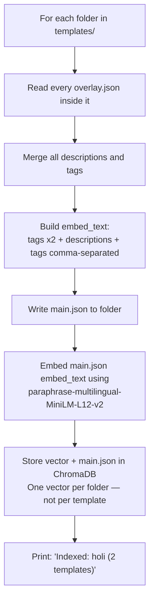

**When to run the indexer:**
- First time setup
- After adding any new template
- After changing any overlay.json description or tags
- After Phase 2 zone mapper saves a new template (runs automatically)

---

## Layer 2 — RAG Search (Two Stage)

### Stage 1 — Direct embedding (always runs first, free, no LLM)

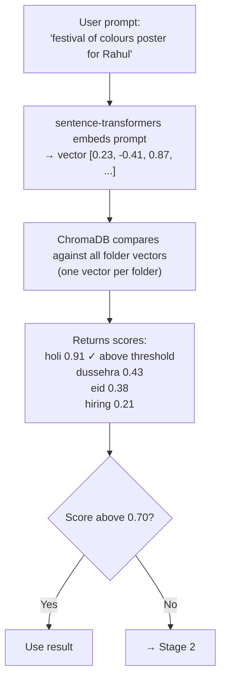

### Stage 2 — Constrained LLM classification (only when Stage 1 fails)

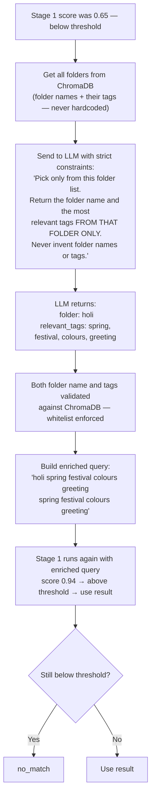

---

## Layer 3 — Field Split Rules

These rules never change. They apply to every single request.

### Single poster generation

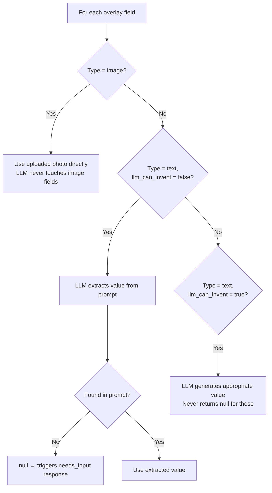

### Bulk Excel generation

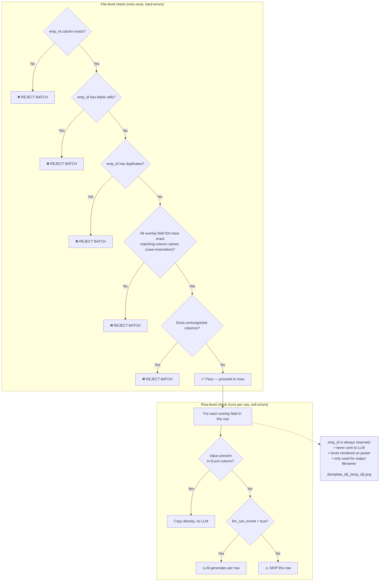

---

## Layer 4 — LLM Rules

LLM is called in exactly these situations and no others.

| Scenario | When LLM is Called |
|---|---|
| **Single generation** | Fill all text fields from prompt — extract identity fields (name, position), generate creative fields (greeting, tagline), return null for missing identity fields |
| **Bulk generation per row** | ONLY for cells that are blank AND field has `llm_can_invent = true`. Never for cells with a value, never for `emp_id`, never for image fields |
| **RAG Stage 2 (fallback only)** | ONLY when Stage 1 score below 0.70. Constrained to existing folder names & tags. Returns folder + relevant tags only |
| **Never called for** | Column name mapping, fuzzy matching, any bulk field with a value, image fields, `emp_id` |

### LLM retry logic

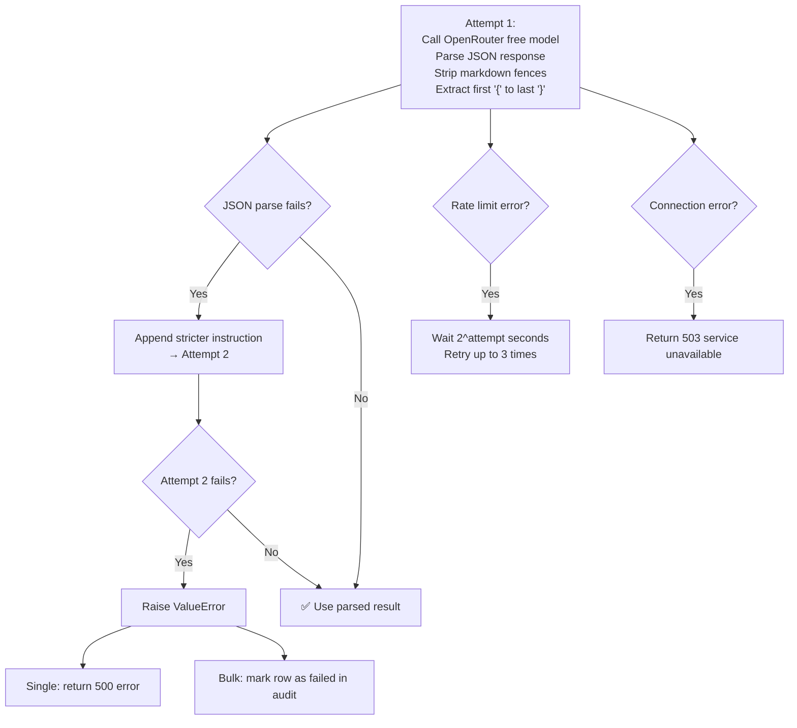

---

## Layer 5 — Renderer Rules

**Input:**
- template dict (from overlay.json)
- overlay_values dict `{"name": "Rahul", "greeting_line": "Happy Holi!"}`
- output_path (new file, never original)
- uploaded_image_path (optional)

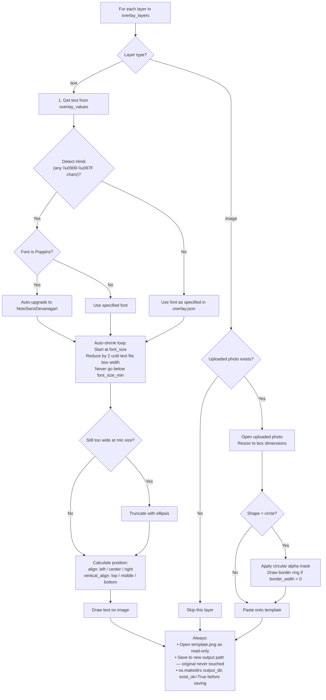

---

## Layer 6 — All Response Cases

### Single generation — every possible outcome

**`POST /generate`**

| Case | Condition | Response | Streamlit Action |
|------|-----------|----------|------------------|
| 1 | Empty prompt | HTTP 400 `"Prompt cannot be empty"` | — |
| 2 | No match found | `{"status": "no_match", "trigger_phase2": true}` | Shows "Create new template?" button → opens Phase 2 |
| 3 | Ambiguous prompt | `{"status": "ambiguous", "matches": [...]}` | Shows category picker buttons → resubmit with folder locked |
| 4 | One folder, multiple designs | `{"status": "gallery", "folder": "holi", "templates": [...]}` | Shows design cards → resubmit with template_id locked |
| 5 | Required field missing | `{"status": "needs_input", "missing_fields": ["name"]}` | Shows form for missing fields → resubmit with extra fields |
| 6 | AI service down | HTTP 503 `"AI service unavailable"` | Shows retry button |
| 7 | Success | FileResponse — PNG file | Shows image + download button |

### Bulk generation — every possible outcome

**`POST /bulk`**

| Case | Condition | Response | Streamlit Action |
|------|-----------|----------|------------------|
| 1 | Wrong file format | HTTP 422 `"Could not read file. Upload .xlsx or .csv"` | — |
| 2 | emp_id column missing | HTTP 422 `"Column emp_id is required. Found: [name, city]"` | — |
| 3 | Blank emp_id cells | HTTP 422 `"Blank emp_id at rows: [5, 12, 23]"` | — |
| 4 | Duplicate emp_ids | HTTP 422 `"Duplicate emp_id values: [EMP001, EMP045]"` | — |
| 5 | No template match | `{"status": "no_match", "trigger_phase2": true}` | — |
| 6 | Ambiguous folder match | `{"status": "ambiguous", "matches": [...]}` | User must pick folder before bulk runs |
| 7 | Multiple designs in folder | `{"status": "gallery", "templates": [...]}` | User must pick one design before bulk runs |
| 8 | Missing required columns | `{"status": "column_mismatch", "missing_required_columns": [...]}` | Shows exactly what to rename |
| 9 | Job queued successfully | `{"status": "queued", "job_id": "abc123", "total_rows": 50}` | Polls `/job-status/{job_id}` every 2s, shows live progress bar |
| 10 | Row skipped | Row skipped silently | Logged in audit CSV and skipped_rows.json, batch continues |
| 11 | Render fails for one row | Row marked as `failed_render` in audit CSV | Batch continues with all other rows |
| 12 | Job complete | `{"status": "done", "total": 50, "completed": 47, ...}` | Shows summary + download ZIP button |

**ZIP contents:**
- All successfully rendered PNGs
- `audit.csv` (every row, status, timestamp)
- `skipped_rows.json` (which rows, which fields, why)

---

## Layer 7 — Phase 2 Zone Mapper

Triggered when status is `no_match`.

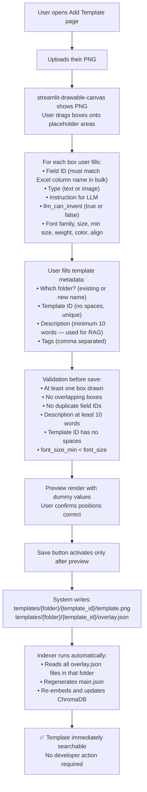

---

## Layer 8 — Font Handling

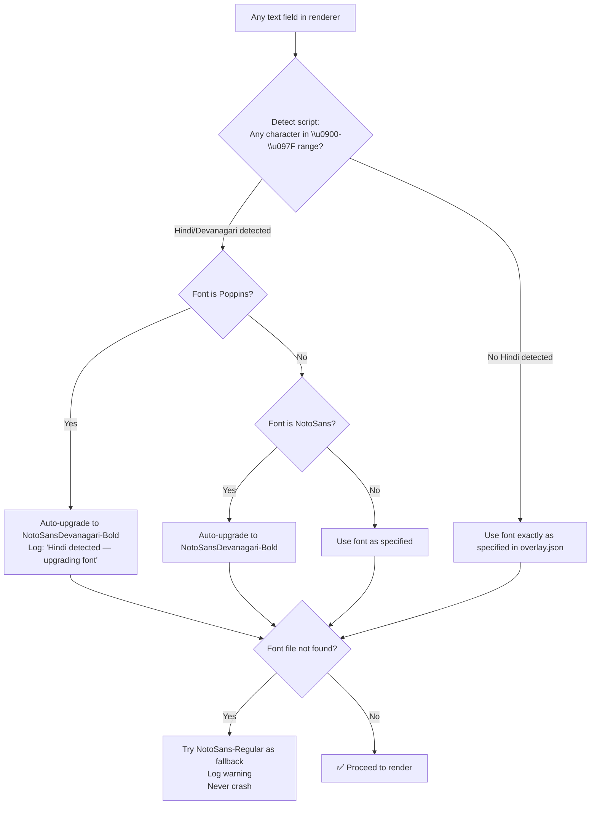

**Font files required in `fonts/`:**

| File | Purpose |
|------|---------|
| `Poppins-Regular.ttf` | English body text |
| `Poppins-Bold.ttf` | English headings |
| `Poppins-SemiBold.ttf` | English poster titles |
| `NotoSans-Regular.ttf` | Mixed English/Hindi fallback |
| `NotoSans-Bold.ttf` | Mixed bold fallback |
| `NotoSansDevanagari-Bold.ttf` | Pure Hindi text |

---

## Layer 9 — Job Tracking

**SQLite `jobs.db` — auto-created on first run**

| Column | Type | Description |
|--------|------|-------------|
| `job_id` | TEXT PRIMARY KEY | Unique job identifier |
| `status` | TEXT | `processing` / `done` |
| `total` | INTEGER | Total rows |
| `completed` | INTEGER | Successfully rendered |
| `skipped` | INTEGER | Rows skipped |
| `failed` | INTEGER | Rows failed |
| `zip_path` | TEXT | Path to output ZIP |
| `created_at` | TEXT | Creation timestamp |
| `updated_at` | TEXT | Last update timestamp |

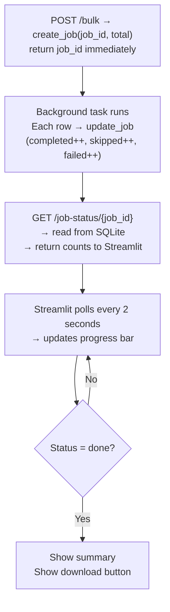

---

## Complete Request Flow — Single Poster

```mermaid
flowchart TD
    A["User types: 'Holi poster for Rahul Kumar'\nand optionally uploads a photo"] --> B["Streamlit POST /generate"]
    B --> C["Prompt validation:\n• Empty? → 400 error\n• Truncate to 500 chars"]
    C --> D["RAG Stage 1:\nembed prompt → query ChromaDB\nscore 0.91 holi → above 0.70 → match found"]
    D --> E["(Stage 2 skipped — Stage 1 succeeded)"]
    E --> F["holi folder has 2 templates → gallery response"]
    F --> G["Streamlit shows holi01 and holi02\nUser picks holi01"]
    G --> H["Streamlit resubmits with\nfolder=holi, template_id=holi01"]
    H --> I["load_template('holi', 'holi01')\n→ reads overlay.json from disk"]
    I --> J["field_split.py:\nFields: name (llm_can_invent=false),\ngreeting_line (llm_can_invent=true)\nBoth go to LLM since this is single generation"]
    J --> K["llm.py → OpenRouter free model:\nPrompt: 'Holi poster for Rahul Kumar'\nReturns: name='Rahul Kumar',\ngreeting_line='Wishing you a colorful Holi!'"]
    K --> L["null_fields = [] → no missing fields"]
    L --> M["renderer.py:\nOpen template.png read-only\nname: 'Rahul Kumar' → no Hindi → Poppins-Bold\ngreeting_line → no Hindi → Poppins-Regular\nAuto-shrink if needed\nDraw at box coordinates\nSave to output/{uuid}.png"]
    M --> N["FastAPI returns PNG file"]
    N --> O["Streamlit shows poster image\nUser clicks Download"]
```

---

## Complete Request Flow — Bulk Excel

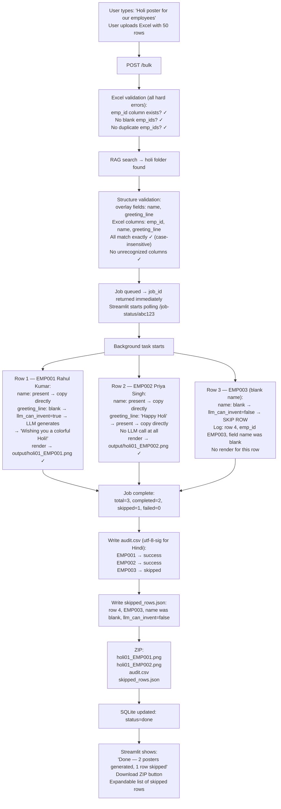

---

## Rules Summary — The Complete Set

### RAG rules
- One vector per folder in ChromaDB, not per template
- `main.json` auto-generated every time indexer runs
- `embed_text` = tags twice + descriptions + tags comma-separated
- Stage 1 always runs first — direct embedding, no LLM cost
- Stage 2 only runs when Stage 1 score below 0.70
- Stage 2 constrained — LLM can only pick from existing folder names and existing tags
- Both folder name and tags validated against ChromaDB whitelist after LLM returns
- Ambiguous = top two scores within 0.08 of each other → show category picker
- No match after both stages → trigger Phase 2

### Field rules
- `emp_id` always reserved — never in overlay.json, never to LLM, never rendered
- Bulk: exact column name match required, case-insensitive, no fuzzy matching
- Bulk: missing column → hard error, reject entire batch
- Bulk: blank value + `llm_can_invent=false` → soft error, skip row, continue batch
- Bulk: blank value + `llm_can_invent=true` → LLM generates for that cell only
- Bulk: value present → copy directly, zero LLM cost
- Single: all fields go to LLM — extract identity, generate creative
- Image fields → uploaded photo always, LLM never

### Renderer rules
- Original `template.png` never modified
- Hindi auto-detected by Unicode range `\u0900-\u097F`
- Hindi detected → auto-upgrade Poppins/NotoSans to NotoSansDevanagari
- Auto-shrink from `font_size` down to `font_size_min` in steps of 2
- Still too wide at min size → truncate with ellipsis
- Missing uploaded photo → skip image layer silently, do not crash
- `output/` created with `exist_ok=True` before every render

### Indexer rules
- Run after any template addition or description change
- Safe to re-run multiple times — always overwrites cleanly
- Validates every overlay.json before indexing
- Rejects: missing required keys, base_image not found, description under 10 words, `font_size_min >= font_size`
- Skips folders with no valid templates, prints SKIP message

### Phase 2 rules
- Preview render mandatory before Save button activates
- Template ID must have no spaces
- Description must be at least 10 words
- At least one box must be drawn
- No overlapping boxes
- No duplicate field IDs within one template
- Indexer runs automatically after save — no developer action needed
- New template immediately searchable after save

---

## Tech Stack

| Component | Technology |
|-----------|-----------|
| Backend | FastAPI + Uvicorn |
| Frontend | Streamlit + streamlit-drawable-canvas |
| Embeddings | sentence-transformers — `paraphrase-multilingual-MiniLM-L12-v2` (local, free, handles Hindi + English) |
| Vector DB | ChromaDB PersistentClient (local, auto-created) |
| LLM | OpenRouter free tier — `meta-llama/llama-3.1-8b-instruct:free` via openai Python package |
| Rendering | Pillow + pillow-heif |
| Data | pandas + openpyxl |
| Job tracking | SQLite (built into Python) |
| Env | python-dotenv + pydantic-settings |

---

## Commands

```cmd
# Always run from ms_fincap/ project root

# Activate venv
venv\Scripts\activate

# Install dependencies (once)
pip install -r requirements.txt

# Index templates (run after any template change)
python backend/indexer/indexer.py

# Start backend (terminal 1)
uvicorn backend.main:app --reload

# Start frontend (terminal 2)
streamlit run frontend/app.py
```

---

> That is the complete architecture. Every decision from every part of our conversation is captured here — the folder-based RAG, the two-stage search with constrained LLM fallback, the strict field rules, the soft row skipping, the Hindi font auto-upgrade, the Phase 2 zone mapper, and every possible response case for both single and bulk generation.
