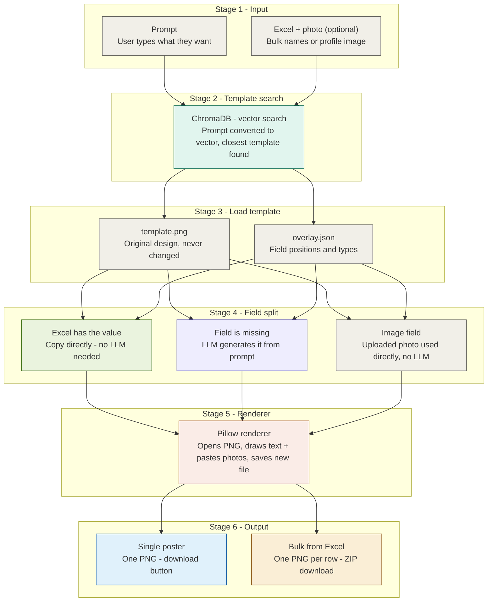

# MS Fincap AI Template Platform — Full Architecture

This document describes the 6-stage architecture of the MS Fincap AI template platform, converted from the visual architecture flow diagram.

---

## Architecture Flow Diagram

---

## Detailed Stages Breakdown

### Stage 1 — Input
*   **Prompt**: The user inputs a text description of the design/poster they want to generate.
*   **Excel + photo (optional)**: The user can optionally upload an Excel spreadsheet for bulk generation (e.g., list of names) or a profile image/photo for custom embedding.

### Stage 2 — Template Search
*   **ChromaDB (Vector Search)**: 
    *   The user's prompt is converted into a vector embedding.
    *   A similarity search is conducted in ChromaDB to find the template whose metadata/vector is closest to the request.

### Stage 3 — Load Template
Once the best-matching template is identified, the system loads its configuration:
*   `template.png`: The static original design/layout background (untouched/never mutated directly).
*   `overlay.json`: Definition of coordinates, fonts, fields, formatting styles, and data types for all dynamic elements on the template.

### Stage 4 — Field Split
Dynamic data validation and population logic is split as follows:
*   **Direct Path**: If the user uploaded an Excel file and the field value exists in it, it is copied directly without calling an LLM.
*   **LLM Generation Path**: If the field data is missing, the LLM (Claude API) generates content automatically based on the user's prompt.
*   **Image Processing**: Any image fields bypass the LLM and use the user's uploaded photo directly.

### Stage 5 — Renderer
*   **Pillow Renderer**: A Python imaging engine opens `template.png`, draws target texts at defined coordinates, overlays/pastes photos if any, and saves the result as a new composite image.

### Stage 6 — Output
*   **Single Poster**: Generates one final PNG image, rendered directly with a download button.
*   **Bulk from Excel**: Iterates through each row in the spreadsheet, generating one PNG per row, and packages them into a single ZIP file for download.
*   *Note: The original `template.png` remains untouched throughout the entire execution.*

---

## Technology Stack

The platform is built using the following core components and libraries:
*   **Vector Search & Embeddings**: ChromaDB, Sentence Transformers
*   **LLM API Integration**: Claude API (Anthropic)
*   **Image Rendering**: Pillow (PIL)
*   **Backend & Frontend Frameworks**: FastAPI, Streamlit
